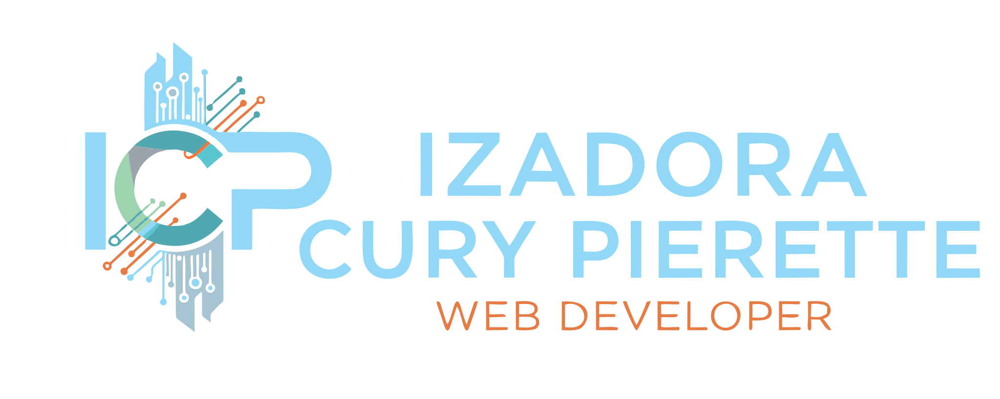
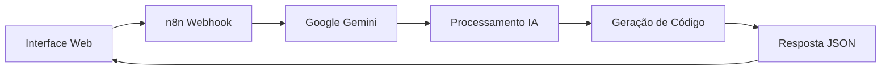

# 🎨 Fundo Mágico

<div align="center">
  
  
  <p><em>Transforme suas ideias em backgrounds incríveis com o poder da IA e do n8n</em></p>
  
  [](https://developer.mozilla.org/en-US/docs/Web/HTML)
  [](https://developer.mozilla.org/en-US/docs/Web/CSS)
  [](https://developer.mozilla.org/en-US/docs/Web/JavaScript)
  [](https://n8n.io/)
  [](https://gemini.google.com/)
</div>

---

## 📖 Sobre o Projeto

**Fundo Mágico** é uma aplicação web inovadora que utiliza inteligência artificial para gerar backgrounds CSS animados personalizados. Através de uma integração inteligente entre **n8n** (ferramenta de automação) e **Google Gemini** (IA), os usuários podem descrever suas ideias em linguagem natural e receber códigos CSS prontos para uso.

### 🎯 Objetivo

Democratizar a criação de backgrounds animados para desenvolvedores e designers, eliminando a barreira técnica através de uma interface intuitiva e resultados profissionais.

---

## ✨ Funcionalidades

### 🎨 **Geração Inteligente de Backgrounds**
- Entrada de texto em linguagem natural
- Processamento via IA (Google Gemini)
- Geração automática de HTML e CSS animado
- Visualização em tempo real

### 🔧 **Interface Profissional**
- Design responsivo e moderno
- Tema escuro elegante
- Animações suaves e intuitivas
- Experiência otimizada em todos os dispositivos

### 📋 **Sistema de Documentação**
- Modal informativo sobre a automação n8n
- Código JSON protegido contra cópia não autorizada
- Funcionalidade de cópia controlada
- Documentação técnica completa

### 🛡️ **Segurança e Proteção**
- A idéia aqui foi: tentar simular uma proteçao documental para fins educacionais, permitindo a cópia do código apenas por botão designado.
- Proteção contra cópia não autorizada do código JSON
- Desabilitação de menu de contexto em áreas sensíveis
- Controle de seleção de texto
- Proteção contra atalhos de teclado

---

## 🚀 Como Usar

### 1. **Descrição do Background**
```
Digite sua ideia na caixa de texto:
"um gradiente azul suave que vai do azul claro para o azul escuro"
```

### 2. **Geração Automática**
- Clique em "Gerar Background Mágico"
- Aguarde o processamento da IA
- Visualize o resultado gerado

### 3. **Obtenha os Códigos**
- HTML pronto para uso
- CSS com animações incluídas
- Copie e implemente em seus projetos

---

## 🏗️ Arquitetura Técnica

### **Frontend**
- **HTML5 Semântico**: Estrutura acessível e moderna
- **CSS3 Avançado**: Animações, gradientes e responsividade
- **JavaScript Vanilla**: Interatividade e manipulação do DOM

### **Backend/Automação**
- **n8n Workflow**: Orquestração do processo de geração
- **Google Gemini API**: Processamento de linguagem natural
- **Webhook Integration**: Comunicação entre frontend e IA

### **Fluxo de Dados**


---

## 📁 Estrutura do Projeto

```
3-fundo-magico/
├── index.html                 # Página principal
├── src/
│   ├── css/
│   │   ├── reset.css         # Normalização CSS
│   │   ├── estilos.css       # Estilos principais
│   │   └── responsivo.css    # Media queries
│   ├── images/
│   │   ├── bg.png           # Background principal
│   │   └── logo300x100-fundo-escuro.svg # Logo oficial
│   └── js/
│       ├── index.js         # Lógica principal
│       └── modal.js         # Funcionalidades do modal
├── fundo-magico.json        # Configuração n8n
└── README.md               # Documentação
```

---

## 🛠️ Instalação e Execução

### **Pré-requisitos**
- Navegador web moderno
- Servidor local (opcional)
- Conexão com internet (para fontes e IA)

### **Instalação**
```bash
# Clone o repositório
git clone https://github.com/seu-usuario/fundo-magico.git

# Navegue até o diretório
cd fundo-magico

# Abra o index.html no navegador ou use um servidor local
python -m http.server 8000
# ou
npx serve .
```

### **Configuração n8n**
1. Importe o arquivo `fundo-magico.json` no n8n
2. Configure as credenciais do Google Gemini
3. Ative o webhook
4. Atualize a URL do webhook no código JavaScript

---

## 🎨 Personalização

### **Cores e Temas**
```css
/* Variáveis CSS para fácil customização */
:root {
  --primary-color: #ff6b35;
  --secondary-color: #f7931e;
  --background-dark: #0f131a;
  --text-light: #ffffff;
}
```

### **Animações**
```css
/* Personalizar transições */
.btn-magic {
  transition: all 0.3s ease;
  transform: translateY(-2px);
}
```

---

## 🔌 API e Integração

### **Endpoint Principal**
```javascript
const API_URL = 'https://seu-n8n-instance.com/webhook/gerador-fundo';

fetch(API_URL, {
  method: 'POST',
  headers: {
    'Content-Type': 'application/json',
  },
  body: JSON.stringify({
    description: 'sua descrição aqui'
  })
})
```

### **Formato de Resposta**
```json
{
  "code": "<div class=\"bg\"></div>",
  "style": "CSS animado gerado",
  "preview": "HTML de preview"
}
```

---

## 🧪 Testes e Qualidade

### **Testes Manuais**
- ✅ Responsividade em diferentes dispositivos
- ✅ Compatibilidade entre navegadores
- ✅ Funcionalidade de cópia e modal
- ✅ Integração com API

### **Boas Práticas**
- Código semântico e acessível
- Otimização de performance
- Proteção de dados sensíveis
- UX/UI consistente

---

## 🚨 Limitações e Considerações

### **Conta Gratuita n8n**
> ⚠️ **Importante**: Este projeto utiliza uma conta gratuita do n8n que pode ter limitações de disponibilidade. O código JSON da automação está disponível como backup.

### **Rate Limits**
- Google Gemini API possui limites de uso
- Recomenda-se implementar throttling para produção

### **Compatibilidade**
- Requer JavaScript habilitado
- Suporte para CSS3 e HTML5
- Conexão com internet necessária

---

## 🤝 Contribuição

Contribuições são bem-vindas! Para contribuir:

1. **Fork** o projeto
2. Crie uma **branch** para sua feature (`git checkout -b feature/nova-funcionalidade`)
3. **Commit** suas mudanças (`git commit -m 'Adiciona nova funcionalidade'`)
4. **Push** para a branch (`git push origin feature/nova-funcionalidade`)
5. Abra um **Pull Request**

### **Diretrizes**
- Siga os padrões de código existentes
- Adicione testes quando apropriado
- Documente novas funcionalidades
- Mantenha a compatibilidade

---

## 📜 Licença

Este projeto está sob a licença MIT. Veja o arquivo [LICENSE](LICENSE) para mais detalhes.

---

## 👤 Autor

**Seu Nome**
- 🌐 Website: [seu-website.com](https://seu-website.com)
- 💼 LinkedIn: [seu-linkedin](https://linkedin.com/in/seu-linkedin)
- 🐦 Twitter: [@seu-twitter](https://twitter.com/seu-twitter)
- 📧 Email: seu-email@exemplo.com

---

## 🙏 Agradecimentos

- **n8n Community** - Pela incrível ferramenta de automação
- **Google Gemini** - Pela poderosa API de IA
- **Open Source Community** - Pelas bibliotecas e inspiração
- **Unsplash** - Pelas imagens utilizadas no projeto

---

## 🔗 Links Úteis

- [Documentação n8n](https://docs.n8n.io/)
- [Google Gemini API](https://ai.google.dev/)
- [MDN Web Docs](https://developer.mozilla.org/)
- [CSS Animation Guide](https://developer.mozilla.org/en-US/docs/Web/CSS/CSS_Animations)

---

<div style="display: flex; align-items: center; gap: 20px;">
  
  
  <div>
    <h3>✨ Transforme suas ideias em realidade com Fundo Mágico ✨</h3>
    
    <p>
      <a href="#🎨-fundo-mágico">🔝 Voltar ao topo</a>
    </p>
  </div>
</div>